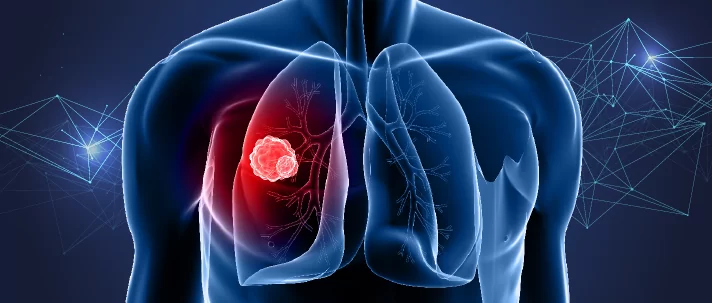

# Lung Cancer Detection 🫁

    

## <a name="system">What does it include?</a>

**Lung Cancer** is the most common cancer in the world. Statistics have been proved that detection in early stages have greater chances of getting cured. Thus, we have successfully developed a machine learning model using Logistic Regression for early detection of Lung Cancer. Our model helps in early detection of Lung Cancer which will help save the lives of the patients because with early detection and diagnosis of Lung Cancer there are higher chances of survival for the patients.

---

**Libraries Used**
- NumPy
- Matplotlib
- Seaborn
- Pandas
- Scikit-learn

**Algorithm Used**
- Logistic Regression

---